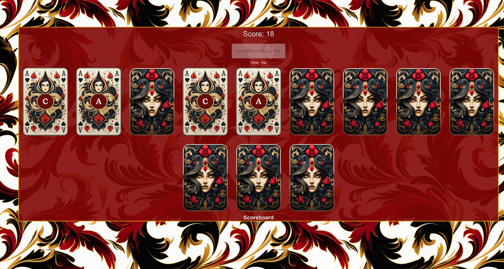
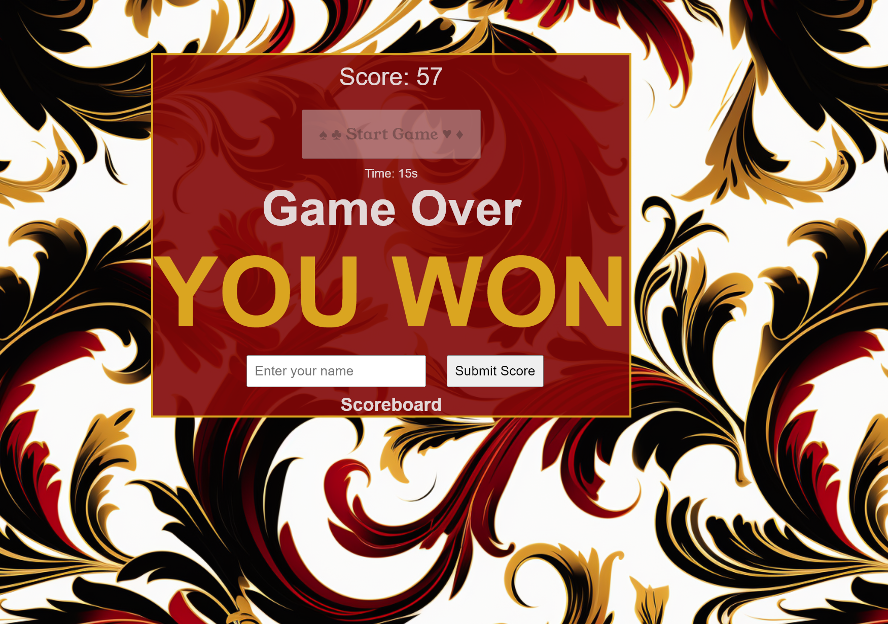

# Welcome to my Match Game!
The code i used to build this game out is simple HTML/CSS and javascript. 

## !!! Game Instructions!!!!
This match game is a single level/difficulty for now. 

Click **"Start Game"** button and the cards will appear on the screen face down.

each card's front side will have a lett A, B or C. 

Match the letters in the given time and win!

whether you win or lose you can keep track of your score each time by placing your name in the input field and hitting submit. 

### Installation?
No install needed. Just open the link in the browser and play!

### My approach to the game
Overall i chose this game because it had plenty of DOM manipulation to work with, and room to grow and personalize in the near future.

- when building this out i chose flex layout to keep a fluid look as i resized the screen.
- I took advantage of creating a lot of functions to simplify and keep code organized.
- at the end i wanted to add sound, but that is WIP as i am still learning to work with timing.

### Unsolved Problems
- sound: it is buggy on when its triggered. working on seeing if timing will help the issue.

### Stretch Goals
- Dark and Light Mode
- Different Deck colors/themes
- peristant score board
- upgrade list to object so i can use json or DB
- sound for win/lose results


 ## My Code
This snippet is my my timer. the if statement checks for the timer to run out to declare it a lost. I also added another if statement to just make sure that there are still unmatched cards. 

```javascript
// making a timer to make things challenging
function startTimer() {
    timer = setInterval(() => {
        timeLeft--;
        timeDisplay.textContent = `Time: ${timeLeft}s`;
        if (timeLeft <= 0) {
            clearInterval(timer);
            timeDisplay.textContent = 'Time: 0s';
            if (matchedPairs !== shuffledCards.length / 2) {
                loseText.classList.add("loseText");
                loseText.textContent = "YOU LOST!";
                gameOverText.append(loseText);
                endGame();
            }
        }
    }, 1000); // Update the timer every second.
}
```

For my CSS here is a snippet that shows some of the animation required to make things flip. 

```CSS
.card {
    width: 100%;
    height: 100%;
    font-family: 'Young Serif', serif;
    font-size: 2rem;
    display: flex;
    justify-content: center;
    align-items: center;
    cursor: pointer;
    transform-style: preserve-3d;
    transition: transform 0.5s ease;
    border-radius: 10px;


}
.back {
    color: transparent;
    transform: rotateY(180deg);
    background-image: url("https://cdn.discordapp.com/attachments/1160026509638111263/1160131536901914665/cardPNG.png?ex=65338bb0&is=652116b0&hm=7c9ce9caccedd2bfb4c6d1f4da5e132599861eceee91b03fa4363fcde2ee5c73&");
    background-size: 100% 100%;
    background-position: center;
    background-repeat: no-repeat;

}
```

The last snippet 

```HTML
<body>
    <div id="wrapper">
        <div class="scoreboard">
            <span id="score">Score: 0</span>
            <div id="startButton">
            <button id="start-button">♠️ ♣️ Start Game ♥️ ♦️</button>
            </div>
            <input type="text" id="player-name" placeholder="Enter your name" style="display: none;">
            <button id="submit-score" style="display: none;">Submit Score</button>

        </div>
        <div class="timer">
            <span id="time-left">Time: 15s</span>
        </div>
        <div class="game-over">
            <span id="gameOverText">Game Over</span>
        </div>
        <div class="game-board">
            <!-- Cards will be generated dynamically here using JavaScript -->
        </div>
        <div class="score-list">
            <h2>Scoreboard</h2>
            <ol id="score-list">
                <!-- Player names and scores will be added here dynamically -->
            </ol>
        </div>
    </div>
    <script src="match.js"></script>
</body>
```
